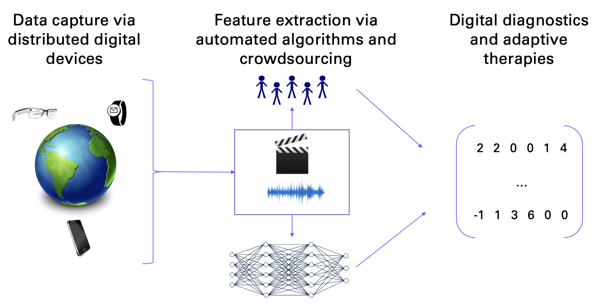
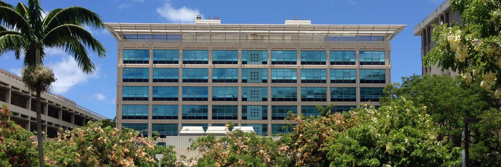

I am an Assistant Professor in the Information & Computer Sciences department at the University of Hawaiʻi at Mānoa. Prior to this role, I completed by PhD in Bioengineering at Stanford University, MS in Computer Science at Stanford University, and BA in Computer Science at Rice University. <a href="https://stacks.stanford.edu/file/druid:rn871vb3166/Stanford_University_Bioengineering_PhD_Thesis__Peter_Washington%20-%20FinalFinal-augmented.pdf" target="_blank">You can read my PhD thesis here.</a>

My research interests include developing data science methods to support machine learning for health and wellbeing, crowdsourcing for precision health, and precise digital diagnostics and interventions (Figure 1). I am interested in applying these methods to a variety of healthcare problems. The Hawaii Digital Health Lab is located at the University of Hawaii at Manoa (Figure 2). When not working, you can find me at one of the many beautiful beaches on Oahu, including but not limited to Lanikai (Figure 3), as well as spending time with my wife Bianca and dog Stella Roo (Figure 4).

 
<b>Figure 1.</b> Overview of the Hawaii Digital Health lab research.
  
 
<b>Figure 2.</b> We are located in the Pacific Ocean Science and Technology (POST) building at the University of Hawaii at Manoa campus.
  
 
<b>Figure 3.</b> Dr. Washington’s favorite local beach (Lanikai).
  
 
<b>Figure 4.</b> Lab mascot: Stella Roo the Cockapoo.

News
------
* November 2022: The Hawaii Digital Health Lab holds is inaugural lab meeting, with several new students joining the lab. PhD students Arby Barone and Chris Slade join the lab. MS students Aditi Jaiswal, Yang Qian, and Tanvir Islam join the lab. Undergraduate students Wilson Tran and Jing Zheng join the lab. Kai-Ying and Arianna Bunnell join as regular lab collaborators primarily advised by other faculty members at UH Manoa. Ali Kargarandehkordi joins as a collaborating MS student from Finland. Welcome and looking forward to working with everyone!
* August 2022: Peter Washington starts the Hawaii Digital Health Lab as an Assistant Professor in Information & Computer Sciences.

Join the lab
------
The Hawaii Digital Health Lab has an opening for some PhD students as well as several openings for masters, undergraduate, and high school students. 

<b>For current University of Hawaii PhD students</b>: RAships are available. I currently like to work with students for about 1 year prior to making an RAship commitment. Usually, this is in the form of mentorship on your masters thesis for course credit (ICS 699 and/or ICS 700). Working together for only 1 semester before making a commitment may be possible in exceptional circumstances. Send me an email with your resume/CV, a description of which of my previous papers interests you and why, and a few sentences about your "dream research project".

<b>For prospective PhD students</b>: I usually like to work with students for about 1 year prior to making a PhD commitment. University of Hawaii has a thesis-based Masters program that leads directly into the PhD program, so I recommend you apply there. If you get past the initial review, I will setup a Zoom call. If you're admitted, we can work together during the Masters, and if all goes well, then continuing onto the PhD will be easy. An alternative option, which some students have tried, is to work with me as a mentor on your undergraduate or masters thesis at another university, which can lead to immediate RAships upon arrival to the University of Hawaii. <b>The number one criteria I look for in prospective students is prior evidence of research publication experience.</b>

<b>For University of Hawaii masters students</b>: Course credit is available in the form of ICS 499, ICS 699, or ICS 700. Note that masters students completing Plan A must complete 6 units of ICS 700 and masters students completing Plan B must complete 6 units of ICS 699. Send me an email with your resume/CV and which of the following skillsets you would like to contribute to the lab: web development, mobile development (iOS or Android), data analysis, and/or machine learning (TensorFlow/Keras or PyTorch).

<b>For University of Hawaii undergraduate students</b>: Course credit is available in the form of ICS 499. In addition, I am actively accepting mentees for the <a href="https://manoa.hawaii.edu/undergrad/urop/student-funding/project/about/" target="_blank">Undergraduate Research Opportunities Program (UROP)</a>. If interested in receiving ICS 499 course credits and/or participating in the UROP program, send me an email with your resume/CV and which of the following skillsets you would like to contribute to the lab: web development, mobile development (iOS or Android), data analysis, data mining, and/or machine learning (TensorFlow/Keras or PyTorch).

