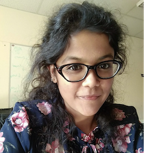
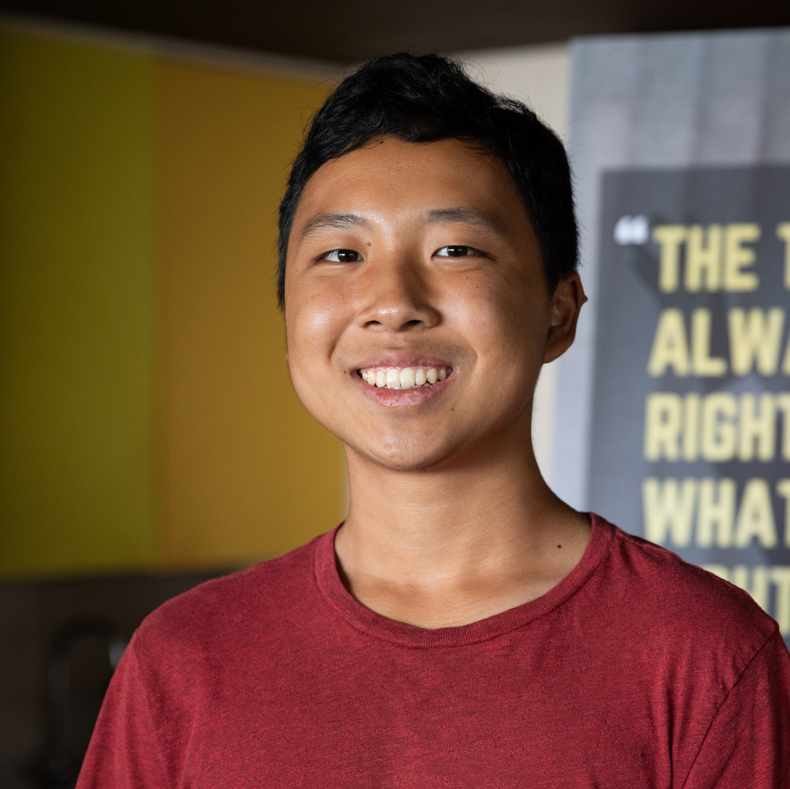
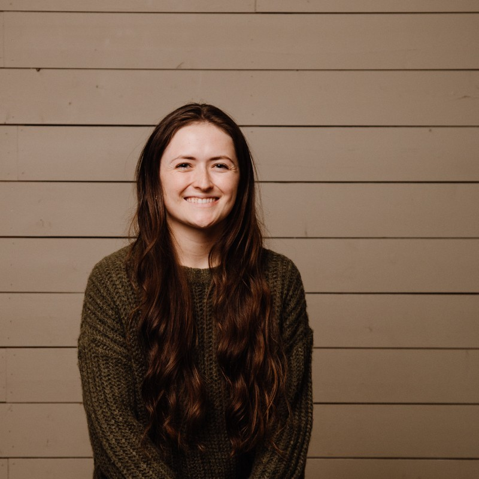

<h2>PhD students</h2>

  

    

      
      

        <h2>Arby Barone</h2>
        
Communication and Information Sciences

        
Gamification of data curation

      

    

  

  

    

      
      

        <h2>Chris Slade</h2>
        
Information and Computer Sciences

        
Mobile sensing and educational therapeutics

      

    

  

  

    

      
      

        <h2>Ali Kargarandehkordi</h2>
        
Information and Computer Sciences

        
Data curation and machine learning

      

    

  

<h2>MS students</h2>

  

    

      
      

        <h2>Aditi Jaiswal</h2>
        
Information and Computer Sciences

        
Social media mining for psychiatry and behavioral sciences

      

    

  

  

    

      
      

        <h2>Yang Qian</h2>
        
Information and Computer Sciences

        
Computer vision and EEG analysis for affective computing

      

    

  

  

    

      
      

        <h2>Tanvir Islam</h2>
        
Information and Computer Sciences

        
Machine learning with wearable biosignals for stress detection

      

    

  

	

    

      
      

        <h2>Armin Soltan</h2>
        
Information and Computer Sciences

        
Fair machine learning for breast cancer detection

      

    

  

  

    

      
      

        <h2>Lydia Sollis</h2>
        
Information and Computer Sciences

        
Digital interventions for diet and exercise

      

    

  

<h2>Undergraduate students</h2>

  

    

      
      

        <h2>Jing Zheng</h2>
        
Information and Computer Sciences

        
Gamification of data curation for affective computing

      

    

  

  

    

      
      

        <h2>Wilson Tran</h2>
        
Information and Computer Sciences

        
Machine learning with wearable biosignals for stress detection

      

    

  

<h2>Collaborating students</h2>

  

    

      
      

        <h2>Arianna Bunnell</h2>
        
Information and Computer Sciences

        
Deep learning for breast cancer detection (primary advisors Peter Sadowski and John Shepherd)

      

    

  

  

    

      
      

        <h2>Kai-Ying Lin</h2>
        
Linguistics

        
NLP detection of age-related cognitive disease (primary advisor Kamil Ud Deen)

      

    

  

  

    

      
      

        <h2>Phee Nimitsurachat</h2>
        
Stanford University

        
Self-supervised learning for human affect

      

    

  

